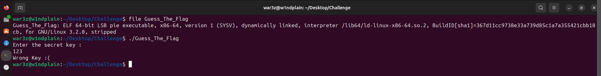
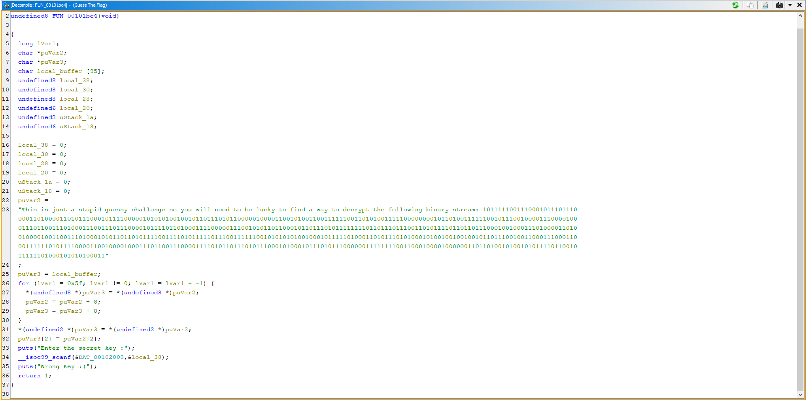
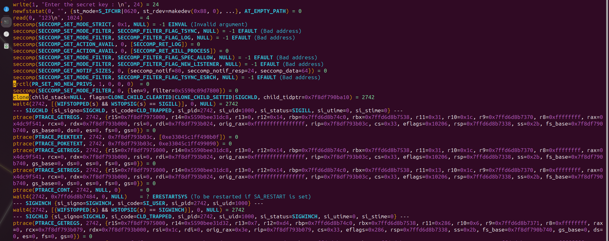
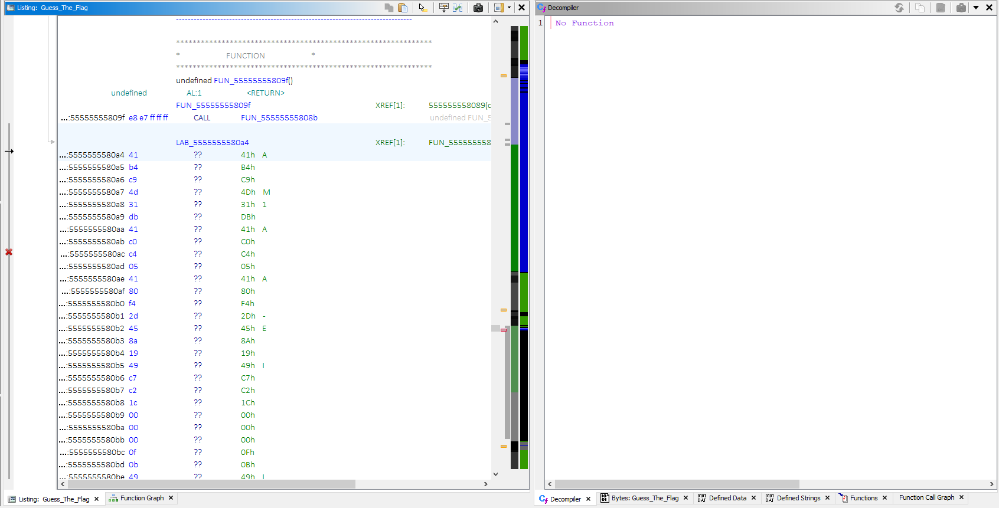
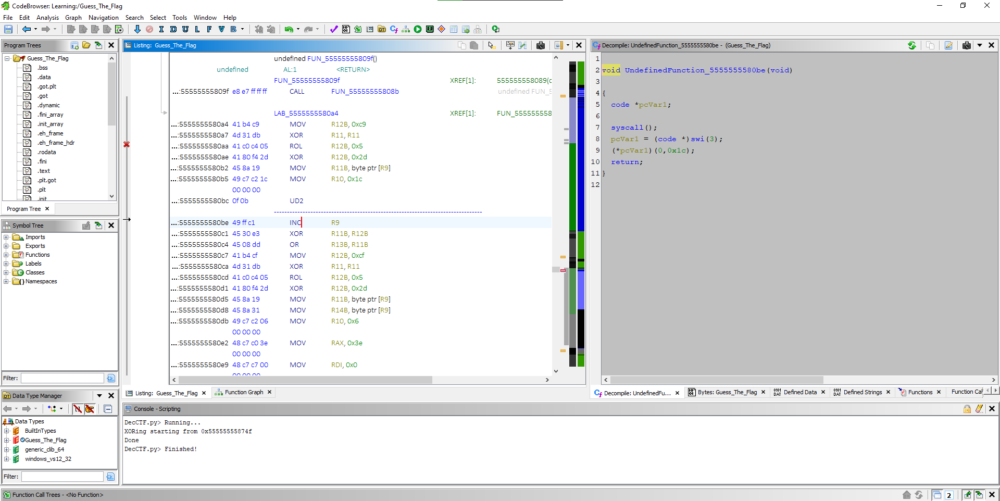
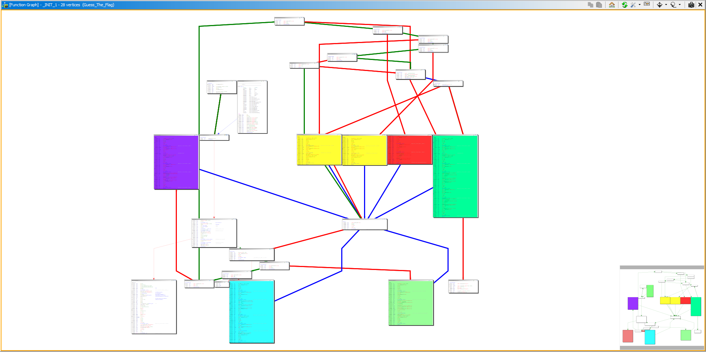
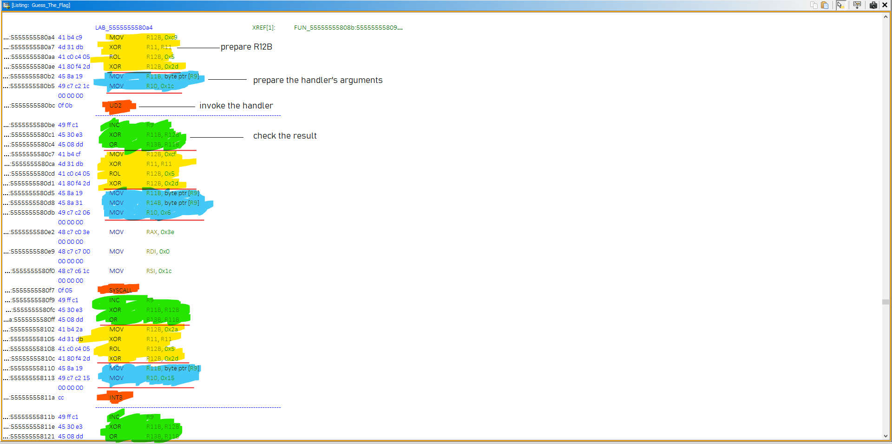
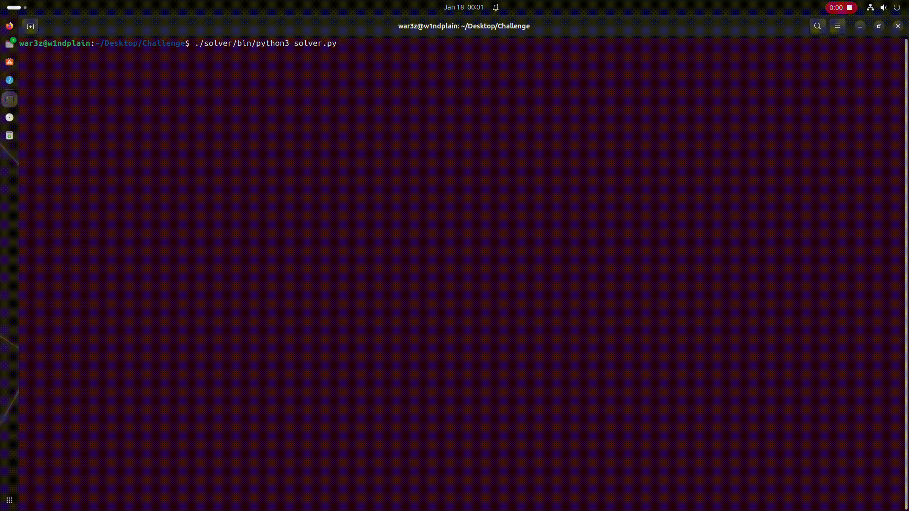

# Guess The Flag
## Introduction
*Guess The Flag* was a reverse engineering challenge in the Arab security cyber wargames qualifications that took place November blah blah. It's a 64bit dynamically linked executable that doesn't show  much of a surprise when executed. It reads a key from the stdin, evaluates it and accordingly shows the result. 



The main function at 0x00101bc4 (Image base: 0x00100000) doesn't seem to be doing anything at all, it copies a string from the rdata section to a local buffer and then returns. It doesn't seem to perform any validation neither the copied string nor the input string.



The imported functions can help solve this mystery. The binary imports fork and  ptrace, indicating it's utilizing nanomites to obsecure its functionality. The output of ptrace verifies this assumption. The trace also shows some interesting signals raised by the child like SIGILL and SIGWINCH.



Tracing the cross references of the fork function shows that it's called from the function at 0x001013a1 , which was conveniently renamed by Ghidra to *_INIT_1*. The function *_INIT_1* is the second entry in the *.init_array* section. The *.init_array* section is an array of function pointers that are called by the c runtime before the main function in the execuable. So our focus should be on reversing the *_INIT_1* function. Here is an excerpt from glibc's ([__libc_start_main_impl](https://codebrowser.dev/glibc/glibc/csu/libc-start.c.html))

```c++

    if (init != NULL)
        /* This is a legacy program which supplied its own init
        routine.  */
        (*init) (argc, argv, __environ MAIN_AUXVEC_PARAM);
    else
        /* This is a current program.  Use the dynamic segment to find
        constructors.  */
        call_init (argc, argv, __environ);

    #else /* !SHARED */
    call_init (argc, argv, __environ);


    _dl_debug_initialize (0, LM_ID_BASE);
    #endif


    __libc_start_call_main (main, argc, argv MAIN_AUXVEC_PARAM);
    
}

```

My approach will be to statically analyze the parent/driver part of the application to determine what the parent does when the child signals it as nanomites is a technique in which a processs  debugs itself, the debugee is driven by the debugger, this in effect obfuscates the execution  of the application making it harder to statically analzye. This also prevents other debuggers from attaching to the debuggee, once it's being traced, making it even harder to analyze ([debug blocker](http://https://www.apriorit.com/white-papers/293-nanomite-technology#:~:text=When%20a%20protected%20program%20is,technique%20is%20called%20Debug%20Blocker. "debug blocker")). 

------------
## _INIT_1


_INIT_1 is, the actual entry point of the application since all the logic is implemented in that function. Additionaly, the function never returns! Whether the input is correct or wrong, _INIT_1 calls exit and main never executes. 

The function starts by decrypting a stack string, by xoring with 0x99, and prints that string to stdout. Turns out this string is the `"Enter the secret key: "` message that we get when executing the application. The same string that 'main' should be displaying 

After reading the flag from stdin, a secure computing (seccomp) context is set with a default rule to allow the unspecified system calls and adds an interesting rule to trap/pause the process if a `sys_fanotify_init` system call was ever initiated from the application.

a call to `fork` is made and then immediately followed by a comparision to determine whether it's the child or the parent that's being executed. If it's the child, a block of memory `(1744 bytes)` is allocated with Read, Write and Execute permissions. A block of code is copied to that memory, the process calls ptrace with a PTRACE_TRACEME request, for the parent to trace the it, sets R9 to the input string then jumps to the allocated memory, 
continuing execution from there.

``` c++

  for (i = 0; i < 0x18; i = i + 1) {
    disp_msg[i] = disp_msg[i] ^ 0x99;
  }

  puts(disp_msg);
  __isoc99_scanf("%38s",&UserSecretKey);
  scmp_ctx = seccomp_init(SCMP_ACT_ALLOW);
  seccomp_rule_add(scmp_ctx,SCMP_ACT_TRAP,sys_fanotify_init,0);
  seccomp_load(scmp_ctx);

  pid = fork();
  // child process
  if (pid == 0) {
  
    lpMappedMem = (qword *)mmap(NULL,0x6d0,PROT_READ | PROT_WRITE | PROT_EXEC,0x22,-1,0);
    for (i = 0; i <= 0x6d0; i++) {
      lpMappedMem[i] = g_bytes[i];
    }

    ptrace(PTRACE_TRACEME,0,0,0);
    (*(code *)lpMappedMem)(&UserSecretKey);
                    /* WARNING: Subroutine does not return */
    exit(0);
  }

  // parent process
  else
  {
    /*
     driver code 
    */
  }

```

The bytes written to the allocated memory are instructions encrypted with an xor scheme, a stub code decrypts the bytes and begins the execution of the child's logic from the decrypted code.



I wrote a simple ghidra script to deobfuscate the code.



The child process uses different ways to get the parent's attention. 
 - UD2 to raise a SIGILL signal
 - syscalls to raise SIGWINCH and SIGCONT signals
 - INT3 to rais SIGTRAP
 - Division by Zero interupts
 - Reading memory from invalid locations for SIGSEGV
 - calling sys_fanotify_init which will trap the process because of the seccomp rule

Each of these methods has a corresponding handler in the parent process, and that's how the parent drives its child



------------


Now to the analysis of each handler in the parent process

> ``` 1. UD2 Handler ```

executed when the child executes the UD2 instruction, which raises an invalid opcode exception. The handler first NOPs out the instruction in the child process' memory by overwriting the opcodes with \x90. then it rotates the LSB  in the R11 register to the right by LSB of R10 & 0x7 and resumes the child execution.

```c++
    else if (reason == SIGILL) {
        // 2 NOPs
      ptrace(PTRACE_GETREGS, child, 0, &ChildContext);
      instructions = ptrace(PTRACE_PEEKTEXT,(child, ChildContext.rip, 0));
      patched_instructions = instructions & 0xffffffffffff0000 | 0x9090;            // NOP out the UD2 instruction
      ptrace(PTRACE_POKETEXT,child,ChildContext.rip,patched_instructions);


      ptrace(PTRACE_GETREGS,child,0,&ChildContext);
      newR11 = ma_ror((char)ChildContext.r11,(uint)ChildContext.r10);
      ChildContext.r11 = (qword)newR11;
      ptrace(PTRACE_SETREGS,(ulong)child,0,&ChildContext);                          //  R11 = rol(R11 & 0xff, R10 & 0x7)
    }
```

------------


> ```2. SYSCALL Handler```

the child process uses syscall to invoke the kill function to raise 2 types of exceptions, SIGCONT and SIGWINCH

`a. SIGCONT Handler`
		
it xors the LSB of R10 with 0x41 then rotates left the LSB of R14 by the result of the xor.  R11 is set to the result of this rotation.
``` c++
        if (reason == SIGCONT) {
          ptrace(PTRACE_GETREGS,child,0,&ChildContext);
          newR11 = ma_xor_rol(ChildContext.r14 & 0xff,ChildContext.r10 & 0xff);
          ChildContext.r11 = (qword)newR11;
          ptrace(PTRACE_SETREGS,child,0,&ChildContext);
        }
```
------------
`b. SIGWINCH Handler`

similar to the SIGCONT handler except that it xors R10 with 0x44 and rotates R14 to the right. R11 is set to the result of this rotation.
	
```c++
        else if (reason == SIGWINCH) {
          ptrace(PTRACE_GETREGS,child,0,&ChildContext);SIG
          newR11 = ma_xor_ror(ChildContext.r14 & 0xff,ChildContext.r10 & 0xff);
          ChildContext.r11 = (qword)newR11;
          ptrace(PTRACE_SETREGS,child,0,&ChildContext);
        }
```

------------


> ```3. INT3 Handler```

executed when the child process executes an INT3 instruction. The handler is basically a rotate left, rotates the LSB of R11 to the left using the LSB of R10 

```c++
    if (reason == SIGTRAP) {
        // Fetches the opcodes but doesn't modify/write them back
      ptrace(PTRACE_GETREGS,child,0,&ChildContext);
      instructions = ptrace(PTRACE_PEEKTEXT,child,ChildContext.rip,0);
      patched_instructions = instructions & 0xffffffff00000000 | 0x90909090;

        // Updates R11
      newR11 = ma_rol((byte)ChildContext.r11,(uint)ChildContext.r10);
      ChildContext.r11 = (qword)newR11;
      ptrace(PTRACE_SETREGS,child,0,&ChildContext);        // R11 = rol(R11 & 0xff, R10 & 0x7)
    }
```

------------

>``` 4. SIGFPE Handler ```

executed when a divison by zero occurs. The handler NOPs out the offending instruction and then adds the LSB of R10 to the LSB of R11

```c++
    else if (reason == SIGFPE) {
    
        // 3 NOPs
      ptrace(PTRACE_GETREGS,child,0,&ChildContext);
      instructions = ptrace(PTRACE_PEEKTEXT,child,ChildContext.rip,0);
      patched_instructions = instructions & 0xffffffffff000000 | 0x909090;
      ptrace(PTRACE_POKETEXT,child,ChildContext.rip,patched_instructions);

        // Update R11
      newR11 = ma_add(ChildContext.r11 & 0xff,ChildContext.r10 & 0xff);
      ChildContext.r11 = (qword)newR11;
      ptrace(PTRACE_SETREGS,child,0,&ChildContext);
    }
```

------------

> ``` 5. SIGSEFV Handler ``` 

An invalid memory reference, caused by reading from address 0x0. The handler is an xor operation, xoringthe LSBs of both R11 and R10

```c++
    else if (reason == SIGSEGV) {
        // 8 NOPs
      ptrace(PTRACE_GETREGS,child,0,&ChildContext);
      instructions = ptrace(PTRACE_PEEKTEXT,child,ChildContext.rip,0);
      patched_instructions = instructions & 0xffffffff00000000 | 0x90909090;
      ptrace(PTRACE_POKETEXT,child,ChildContext.rip,patched_instructions);
      instructions = ptrace(PTRACE_PEEKTEXT,child,ChildContext.rip + 4,0);
      patched_instructions = instructions & 0xffffffff00000000 | 0x90909090;
      ptrace(PTRACE_POKETEXT,child,ChildContext.rip + 4,patched_instructions);

        // Update R11
      newR11 = ma_xor(ChildContext.r11 & 0xff,ChildContext.r10 & 0xff);
      ChildContext.r11 = (qword)newR11;
      ptrace(PTRACE_SETREGS,child,0,&ChildContext);
    }
```

------------

>```6. SIGSYS Handler```

Bad system call exception, raised when the child calls sys_fanotify_init as a result of  the secure computing rule that was installed by the child. The child uses that signal  to notify the parent process that it finished execution. The handler fetches the value of the R13 register and if the value is 0 the flag is correct else its incorrect and the handler prints the corresponding status message.

```c++
    if (reason == SIGSYS) {
        ptrace(PTRACE_GETREGS,child,0,&ChildContext);
        instructions = ptrace(PTRACE_PEEKTEXT,child,ChildContext.rip,0);
        patched_instructions = instructions & 0xffffffff00000000 | 0x90909090;

        ma_print_result(ChildContext.r13 & 0xff);
      }

    void ma_print_result(int KeyResult)
    {
        if (KeyResult == 0) 
            puts((char *)"Correct Flag :D");
  
        else 
            puts((char *)"Wrong Flag :(");
                    /* WARNING: Subroutine does not return */
        exit(0);  
    }
```

------------

------------


From the analysis of the parent's handlers, it can be safely assumed that the register R13 is set to the result of the flag verification algorithm. 

By insepcting the decrypted code of the child process, for each input character:
1. A values is computed for R12B, this value is the same for each character position (doesn't depend on input)
1. The registers used by the handler are set up (the handler's parameters), with R11B being the current character
    in the input.
1. A signal is raised, transfering control to the parent.
1. The result for that character in input is cached in R13B.




## solution

Since the algorithm used to verify the flag is a mix of xor, rol and ror it can be reversed, but I will go with bruteforcing since the iterations aren't that much (max 3000) and I think it would be easier. 


