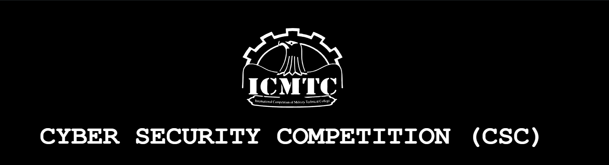
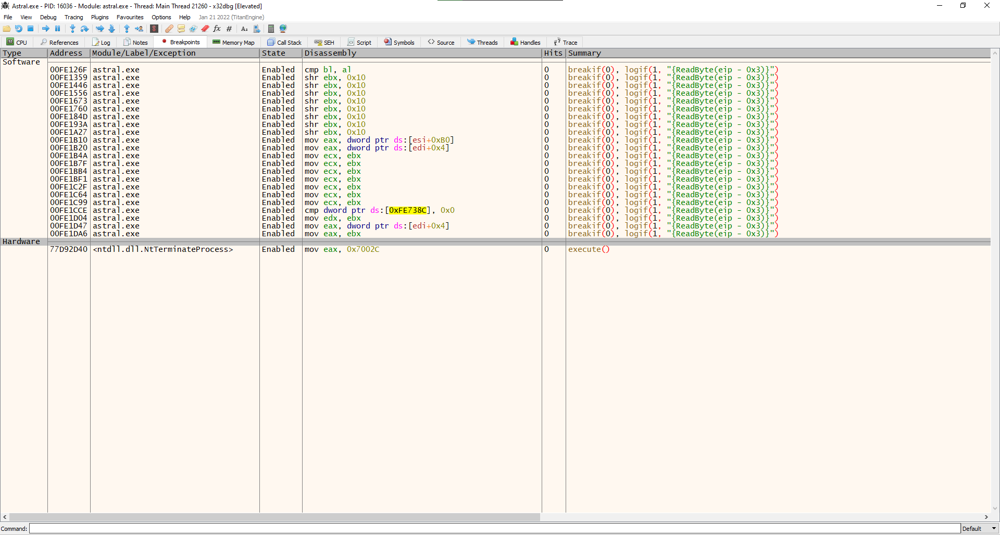
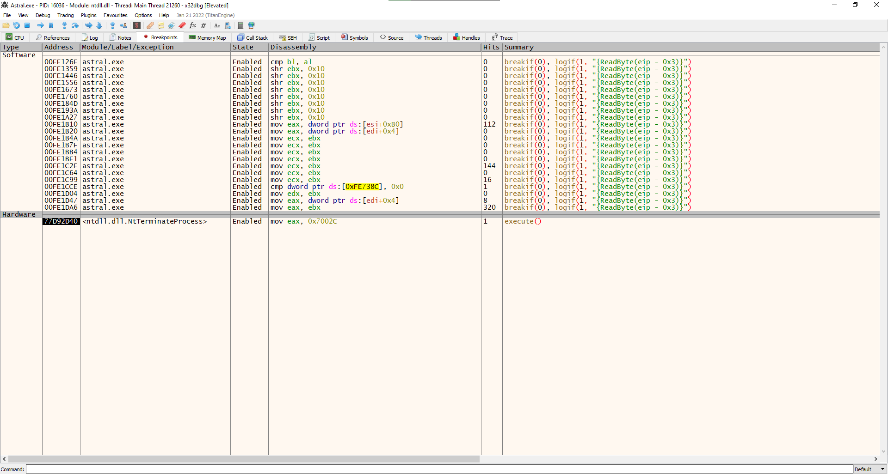
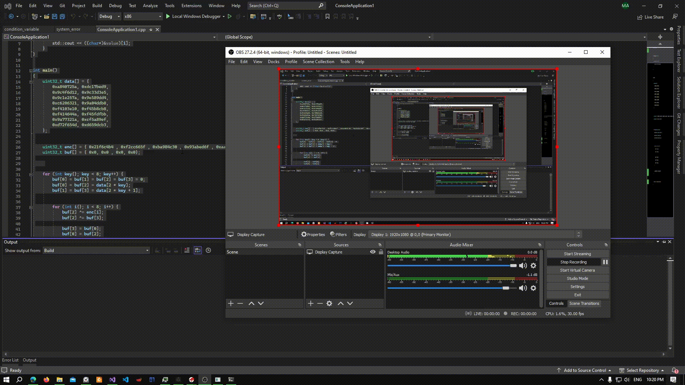

# Astral



Astral was a [hard] reverse engineering challenge in the ICMTC CTF 2023. Astral utilizes "Exception Oriented Programminng" by abusing software exceptions as a means of control flow. We will be looking at how to analyze this binary and obtain the flag.

### Analysis
#### 1- main()

```cpp
int ma_main(int argc,char **argv)
{
      1  code *pcVar1;
      2  char *flag_ptr;
      3  char flag_buf [68];
      4  uint local_8;
       
      5  local_8 = DAT_00ad7004 ^ (uint)&stack0xfffffffc;
      6  flag_ptr = flag_buf;
      7  memset(flag_ptr,0,0x41);
      8  ma_printf("Enter The Flag:\n",flag_ptr);
      9  ma_scanf("%s",(char)flag_buf);
      10 ma_AddVectoredExceptionHandler = (code *)ma_GetAddVectoredExceptionHandler();
      11 (*ma_AddVectoredExceptionHandler)(1,ma_VMHandler);
      12 @__security_check_cookie@4(local_8 ^ (uint)&stack0xfffffffc);
      13 return;
}
```
The main function seems to perform 2 actions:
1. Line (10) the function `ma_GetAddVectoredExceptionHandler` defined at the address `0x00ad1090` gets the address of the `AddVectoredExceptionHandler` function by traversing the loaded modules and comparing the names of each function with a pre-calculated hash. you can read more about the function here [msdn: AddVectoredExceptionHandler](https://learn.microsoft.com/en-us/windows/win32/api/errhandlingapi/nf-errhandlingapi-addvectoredexceptionhandler)
2. Line (11) registers the function `ma_VMHandler` defined at the address `0x00ad1240` to be used as the exception handler (The CPU of the executable's VM)

After that, the program begins executing its instructions. This is done by intentionally causing an exception, in this case the exception used is of type `EXCEPTION_INT_DIVIDE_BY_ZERO` which is raised whenever a division by zero is performed. The sequence used to raise an exception is by setting a register to zero, by xoring it by itself, and then using the `IDIV` instruction 
``` asm
        00ad1e34 33 f6           XOR                            ESI,ESI
        00ad1e36 f7 fe           IDIV                           ESI
```
To communicate data with the handler, passing data or setting which operation to be performed, the program sets a context right before raising the exception
``` asm
        00ad1e42 8b 45 b8           MOV                            EAX,dword ptr [EBP + flag_[0]]
        00ad1e45 b9 0a 00 00 00     MOV                            ECX,0xa
        00ad1e4a 33 f6              XOR                            ESI,ESI
        00ad1e4c f7 fe              IDIV                           ESI
```

#### 2- VMHandler()
The function is responsible for decoding the exception and execute the required function encoded in the exception context. A quick analysis of the function shows that there is a total of `22 handlers` that correspond to `22 operations`. Before any further analysis, i will run the executable in a debugger setting a breakpoint at the start of each handler to determine the 'hotspots' of the function. 



and after running the executable




it can be seen that only `6 handlers` out of the 22 are executed, which greatly simplifies our job!
the executed handlers are:
- `0x0A` executed for a total of 122 times.
- `0x10` executed for a total of 144 times.
- `0x12` executed for a total of   6 times.
- `0x13` executed for a total of 1 time.
- `0x15` executed for a total of 8 times.
- `0x16` executed for a total of 320 times.

our job now is to analyze each of those handlers.

Before analyzing the handlers we need to first check the `ma_VMHandler` function as its prolog will be executed for each handler type.
``` cpp
int ma_VMHandler(EXCEPTION_POINTERS *param_1)
    {
        /* Local variables here */
        
    1   if (param_1->ExceptionRecord->ExceptionCode != EXCEPTION_INT_DIVIDE_BY_ZERO) {
    2     return 0;
    3   }
    4   ctx = param_1->ContextRecord;
    5   ctx.ecx = ctx->Ecx;
    6   operation = ctx.ecx & 0xff;
    7   data = (char)(ctx.ecx >> 0x10);
    8   if (operation == 1) {
      ...
      ...
```
the `if statement` at line (1) checks if the exception is of type `EXCEPTION_INT_DIVIDE_BY_ZERO` as this type is the initiator of the handler function, if not the function simply returns 0 as the exception wasn't raised by logic of the executable.
lines from (4) to (8) decodes which operation to perform by reading the lower byte in the  `ecx` register 

> a- Handler [0x0A]

``` cpp
  ...
  if (operation == 0xa) {
    tmp = ctx->Eax;
  }
  ...
  (&g_Eax)[ctx.ecx >> 8 & 7] = tmp;
```
executed when the lower byte in `ecx` is set to `0x0A`. It reads a dword form the `eax` register and stores it in a global memory `g_Eax`, which is defined at the address `0x00ad7370`, at an offset extracted from the second byte in the `ecx` register. 
So the `handler 0x0a` can be thought of as a `mov` operation. 

> b- Handler [0x10]

``` cpp
  ...
    if (operation == 0x10) {
     (&g_Eax)[ctx.ecx >> 8 & 7] = (&g_Eax)[ctx.ecx >> 8 & 7] ^ (&g_Eax)[ctx.ecx >> 0x10 & 7];
     pDVar1 = &param_1->ContextRecord->Eip;
     *pDVar1 = *pDVar1 + 2;
     return -1;
    }
  ...
```
executed when the lower byte in `ecx` is set to `0x10`. it xors 2 dwords in `g_Eax` at offsets extracted from the the `second` and `third` bytes of the `ecx` register respectively and `stores the result at the first offset`.
So the `handler 0x0a` can be thought of as an `xor` operation. 

> c- Handler [0x12]

``` cpp
  ...
    if (operation == 0x12) {
      (&g_Eax)[ctx.ecx >> 8 & 7] = (&g_Eax)[ctx.ecx >> 8 & 7] | (&g_Eax)[ctx.ecx >> 0x10 & 7];
      pDVar1 = &param_1->ContextRecord->Eip;
      *pDVar1 = *pDVar1 + 2;
      return -1;
    }
  ...
```
executed when the lower byte in `ecx` is set to `0x12`. it ors 2 dwords in `g_Eax` at offsets extracted from the the `second` and `third` bytes of the `ecx` register respectively and `stores the result at the first offset`.
So the `handler 0x0a` can be thought of as an `or` operation. 

> d- Handler [0x13]

``` cpp
  ...
    if (operation == 0x13) {
      enter_flag = "Correct Flag :D\n";
      if (_dat_good != 0) {
        enter_flag = "Wrong Flag :(\n";
      }
      ma_printf(enter_flag,unaff_ESI);
      pDVar1 = &param_1->ContextRecord->Eip;
      *pDVar1 = *pDVar1 + 2;
      return -1;
    }
  ...
```
executed when the lower byte in `ecx` is set to `0x13`. the handler was executed only once when we ran the executable earlier, all it does is that it checks the dword defined at the address `0x00ad738c`. If the dword is `zero` then the flag we entered was correct and it prints the message `"Correct Flag :D\n"` otherwise it prints `"Wrong Flag :(\n"`.

> e- Handler [0x15]

``` cpp
  ...
    if (operation == 0x15) {
      g_Eax = 0;            // 0x00ad7370
      pDVar1 = &param_1->ContextRecord->Eip;
      *pDVar1 = *pDVar1 + 2;
      g_Ebx = 0;            // 0x00ad7374           
      g_Edx = 0;            // 0x00ad7378
      _var1 = 0;            // 0x00ad737c
      _var2 = 0;            // 0x00ad7380
      _var3 = 0;            // 0x00ad7384
      _var4 = 0;            // 0x00ad7388
      return -1;
    }
  ...
```
executed when the lower byte in `ecx` is set to `0x15`. it sets `7 dwords`, `28 bytes`, to `zero` starting from the address `0x0x00ad7370` 

> b- Handler [0x16]

``` cpp
  ...
        if (operation != 0x16) goto LAB_00ad1dc2;
        tmp = (&g_Eax)[ctx.ecx >> 0x10 & 7];
    }
    (&g_Eax)[ctx.ecx >> 8 & 7] = tmp;
  ...
```
executed when the lower byte in `ecx` is set to `0x16`. it reads a dword at an offset extracted from the `third` byte of `ecx` and stores it at an offset extracted from the `second` byte.
So the `handler 0x16` can be thought of as a mov operation.
 ###### Note: the difference between this handler and the `0x0a` handler is that the `0x0a` moves a value from the `eax` register while this handler move it from `memory`
 #


#### 3- Emulation
Since we now understand what the each handler does, we can write an emulator to de-obfuscate the executable and analyze its logic. There are different ways to achieve this goal, what i chose was to inject a dll into the application, using `process hacker`,  to hijack the `ma_VMHandler` function and replace it with mine. My function emulates what the `ma_VMHandler` does as well as logging the instructions it performed so that we can analyze it later. 
> The full source code will be provided at the end of the write-up
#

``` cpp
#define gEAX (0x00407370)

void __stdcall log_gEax()
{
    std::stringstream buf;
    std::stringstream ascii;
    auto _buffer = (const char* const)gEAX;

    for (size_t i{}; i < 32; i++) {
        if (i != 0 && i % 16 == 0) {
            buf << "    " << ascii.str() << '\n';
            ascii.str("");
        }
        buf << std::setw(2) << std::setfill('0') << std::hex << ((int)_buffer[i] & 0xff) << ' ';
        if (std::isprint(((int)_buffer[i] & 0xff)))
            ascii << _buffer[i];
        else
            ascii << ".";
    }

    buf << "    " << ascii.str() << '\n';
    std::cout << buf.str() << std::endl;
}

LONG __stdcall Handler(_EXCEPTION_POINTERS* ctx)
{
    auto ecx = ctx->ContextRecord->Ecx;
    auto op = ecx & 0xff;
    auto geax = (int32_t*)gEAX;

    std::cout << "[OPERATION ";
    switch (op)
    {
    case 0xA:
    {
        std::cout << "0x0A]\n";
        auto eax = ctx->ContextRecord->Eax;
        auto index = (ecx >> 8) & 7;
        geax[index] = eax;
        
        std::cout << "Writing: " << std::hex << eax << '\t' << "at index: " << index << '\n';
        log_gEax();
        break;
    }
    case 0x10:
    {
        std::cout << "0x10]\n";
        auto index = ecx >> 8 & 7;
        auto target = ecx >> 0x10 & 7;

        std::cout << "XORING: " << std::hex << geax[index] << " index: " << index << " With: " << geax[target] << " index: " << target << '\n';
        geax[index] ^= geax[target];
        std::cout << "Result: " << geax[index] << "\tat index: " << index << '\n';
        log_gEax();
        break;
    }
    case 0x12:
    {
        std::cout << "0x12]\n";
        auto index = ecx >> 8 & 7;
        auto target = ecx >> 0x10 & 7;

        std::cout << "ORING: " << std::hex << geax[index] << " index: " << index << " With: " << geax[target] << " index: " << target << '\n';
        geax[index] |= geax[target];
        std::cout << "Result: " << geax[index] << "\tIndex: " << index << '\n';
        log_gEax();

        break;
    }
    case 0x13:
        std::cout << "0x13]\n";
        std::cout << "Showing result!\n";
        break;
    case 0x15:
    {
        std::cout << "0x15]\n";
        std::cout << "Resetting words\n";

        auto _buffer = (char*)gEAX;
        memset(_buffer, 0x00, 7 * 4);
        log_gEax();

        break;
    }
        
    case 0x16:
    {
        std::cout << "0x16]\n";
        auto index = ecx >> 0x10 & 7;
        auto target = ecx >> 8 & 7;
        std::cout << "Moving: " << geax[index] << " Index: " << index << "\tTo: " << geax[target] << " Index: " << target << '\n';
        geax[target] = geax[index];

        log_gEax();
        break;
    }
    default:
        std::cout << "UNNKOWN!]\n";
   
    }

    ctx->ContextRecord->Eip += 2;  
    return -1;
}
```
> Note: you might want to uncheck the `DLL can move` characteristic in the PE file, using CFF Explorer, to disable ASLR making the process easier. 

after loading the dll and executing the application, i got the following output `~3200 lines of logged instructioons :)`


```
Enter The Flag:
Hooked!
1
[OPERATION 0x15]
Resetting words
00 00 00 00 00 00 00 00 00 00 00 00 00 00 00 00     ................
00 00 00 00 00 00 00 00 00 00 00 00 00 00 00 00     ................

[OPERATION 0x0A]
Writing: 31     at index: 0
31 00 00 00 00 00 00 00 00 00 00 00 00 00 00 00     1...............
00 00 00 00 00 00 00 00 00 00 00 00 00 00 00 00     ................

[OPERATION 0x0A]
Writing: 0      at index: 1
31 00 00 00 00 00 00 00 00 00 00 00 00 00 00 00     1...............
00 00 00 00 00 00 00 00 00 00 00 00 00 00 00 00     ................

[OPERATION 0x0A]
Writing: 31     at index: 2
31 00 00 00 00 00 00 00 31 00 00 00 00 00 00 00     1.......1.......
00 00 00 00 00 00 00 00 00 00 00 00 00 00 00 00     ................

[OPERATION 0x0A]
Writing: 0      at index: 3
31 00 00 00 00 00 00 00 31 00 00 00 00 00 00 00     1.......1.......
00 00 00 00 00 00 00 00 00 00 00 00 00 00 00 00     ................

[OPERATION 0x0A]
Writing: c5c3231a       at index: 5
31 00 00 00 00 00 00 00 31 00 00 00 00 00 00 00     1.......1.......
00 00 00 00 1a 23 c3 c5 00 00 00 00 00 00 00 00     .....#..........

[OPERATION 0x16]
Moving: 31 Index: 0     To: 31 Index: 2
31 00 00 00 00 00 00 00 31 00 00 00 00 00 00 00     1.......1.......
00 00 00 00 1a 23 c3 c5 00 00 00 00 00 00 00 00     .....#..........

...
...
...

[OPERATION 0x12]
ORING: 7f7f7f7f index: 7 With: 7d353638 index: 1
Result: 7f7f7f7f        Index: 7
00 04 57 4d 38 36 35 7d 8b ea 6c ab 4d 61 78 9a     ..WM865}..l.Max.
00 00 00 00 b4 c4 f6 21 b3 dc 59 d6 7f 7f 7f 7f     .......!..Y.....

[OPERATION 0x13]
Showing result!

```
#### 4- Analyzing the Encryption
After analyzing the logged instructions, i noticed a repeated sequence in the instructions 
1. `operation 0x15` is invoked to reset the memory.
2. `8 bytes` of the input flag are stored in memory.
3.  For each `4 bytes` of `step 2` `xor` operations are performed `8 times`, using `8 hardcoded constants`.
4.  the result of the previous step, for each 4 bytes of the flag, is `xor`ed against a hardcoded value, for a total of `16 hardcoded values` 2 for each 8 bytes of the flag.
5.  the previous steps are performed `8 times` for a total of `64 bytes` the flag length.
6.  `operation 0x13` is invoked to check the result of the computation.

I noticed that the `8 hardcoded constants` used in the xor operations are stored using the `operation 0x0A` at `index 5`
```
...

[OPERATION 0x0A]
Writing: c5c3231a       at index: 5
00 00 00 00 00 00 00 00 00 00 00 00 00 00 00 00     ................
00 00 00 00 1a 23 c3 c5 00 00 00 00 76 57 7b 77     .....#......vW{w

...

[OPERATION 0x0A]
Writing: 84364179       at index: 5
1a 23 c3 c5 00 00 00 00 1a 23 c3 c5 00 00 00 00     .#.......#......
00 00 00 00 79 41 36 84 00 00 00 00 76 57 7b 77     ....yA6.....vW{w

...
```
here the first 2 constants of the 16 are `0xc5c3231a` and `0x84364179`. 
The `8 hardcoded constants` are 
```
{ 0x21f6c4b4 , 0xf2cc665f , 0xba984c30 , 0x93abed6f , 0xaa08c76c , 0xbde7af54 , 0x84364179 , 0xc5c3231a }
```

And the other `16 hardcoded values` that are used in `step 4` are stored using the operation `0x0A` at `index 6`
```
...

[OPERATION 0x0A]
Writing: a840725a       at index: 6
7c 61 78 9a 8b ea 6c ab 8b ea 6c ab 7c 61 78 9a     |ax...l...l.|ax.
00 00 00 00 b4 c4 f6 21 5a 72 40 a8 00 00 00 00     .......!Zr@.....

[OPERATION 0x10]
XORING: 9a78617c index: 0 With: a840725a index: 6
Result: 32381326        at index: 0
26 13 38 32 8b ea 6c ab 8b ea 6c ab 7c 61 78 9a     &.82..l...l.|ax.
00 00 00 00 b4 c4 f6 21 5a 72 40 a8 00 00 00 00     .......!Zr@.....

[OPERATION 0x12]
ORING: 0 index: 7 With: 32381326 index: 0
Result: 32381326        Index: 7
26 13 38 32 8b ea 6c ab 8b ea 6c ab 7c 61 78 9a     &.82..l...l.|ax.
00 00 00 00 b4 c4 f6 21 5a 72 40 a8 26 13 38 32     .......!Zr@.&.82

[OPERATION 0x0A]
Writing: dc17bed9       at index: 6
26 13 38 32 8b ea 6c ab 8b ea 6c ab 7c 61 78 9a     &.82..l...l.|ax.
00 00 00 00 b4 c4 f6 21 d9 be 17 dc 26 13 38 32     .......!....&.82

...
```

here the first 2 constants of the 8 are `0xa840725a` and `0xdc17bed9`. 
the `16 hardcoded constants` are 
```
{
        0xa840725a, 0xdc17bed9,
        0x9c4f6d12, 0x9c33d3e5,
        0x9c1e257a, 0x9e589dd4,
        0xc6206321, 0x9a04ddb8,
        0xf4103e10, 0xf45b8cb8,
        0xf414644a, 0xf45fdfbb,
        0x9a77321a, 0xcf5a89ef,
        0xd72f654d, 0xd659dcb3,
    }
```

#### 5- The flag
To get the correct flag, the result of the `xor` is `step 4` should be `zero`, which means each `4 bytes` of the flag should, after running the encryption on them, match a constant of the 16 that are used in `step 4`. we can get the flag by using the `16 constants` as input to the previous steps.
Here is the code that achieves just that
``` cpp
#include <iostream>

void asciify(uint32_t value)
{
    for (int i{}; i < 4; i++) 
        std::cout << ((char*)&value)[i];
}

int main()
{
    uint32_t data[] = {
        0xa840725a, 0xdc17bed9,
        0x9c4f6d12, 0x9c33d3e5,
        0x9c1e257a, 0x9e589dd4,
        0xc6206321, 0x9a04ddb8,
        0xf4103e10, 0xf45b8cb8,
        0xf414644a, 0xf45fdfbb,
        0x9a77321a, 0xcf5a89ef,
        0xd72f654d, 0xd659dcb3,
    };

    uint32_t enc[] = { 0x21f6c4b4 , 0xf2cc665f , 0xba984c30 , 0x93abed6f , 0xaa08c76c , 0xbde7af54 , 0x84364179 , 0xc5c3231a };
    uint32_t buf[] = { 0x0, 0x0 , 0x0, 0x0};
    
    for (int key{}; key < 8; key++) {
        buf[0] = buf[1] = buf[2] = buf[3] = 0;
        buf[0] = buf[2] = data[2 * key];
        buf[1] = buf[3] = data[2 * key + 1];

        for (int i{}; i < 8; i++) {
            buf[2] ^= enc[i];
            buf[2] ^= buf[3];

            buf[3] = buf[0];
            buf[0] = buf[2];
            buf[1] = buf[3];
        }

        asciify(buf[1]); asciify(buf[2]); 
    }
}
```
After running it we get the flag 
> EGCERT{w15h1n9_7h3R3_w45_50m37h1n9_13f7_70_1053_309ddc6d82b0865}


