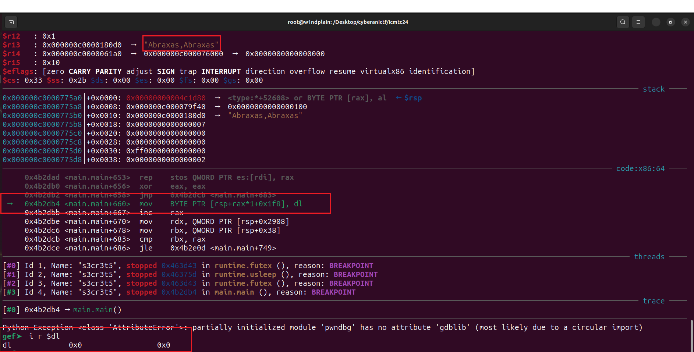

****
> **## Introduction**
****

S3cr3ts was a reverse engineering challenge in the ICMTC 2024 qualifications rounds. It was categorized as hard. The challenge file is a 64-bit non-stripped binary written in Go. What could *go* wrong?


When executed, the program asks for a magic spell and it displays whether the spell, the input, was valid or not. 


Tracing with ltrace and strace didn't result in anything meaningful.  

****
> **## Analysis**
****

For some reason, the challenge kept crashing *gdb* and debugging it with *Ghidra* was not a straightforward process. I tried to debug it with *pwndbg* and for some reason it didn't crash and as such I will be using *Ghidra* for static analysis and *pwndbg* for dynamic execution. Before doing the heavy lifting, I will take a moment to appreciate this piece of art.


The main function of the program, `main.main`, starts at address `0x004b2b20` with the image base set to `0x00400000`. After analyzing the function for some times, it can be logically divided into 4 blocks  


The *initialization* block sets up the state of the function. The second block consists of multiple code constructs that each does some specific *processing.* The third block is all about error handling and irrelevant for our analysis. The final block consists of a sequence of *checks* that verifies whether we should entered the correct spell and get the flag. 

****
> **## Block 1: Initialization**
****

As the name suggests, the code within this block performs various actions that initialize the main state of the program. The basic block starting at address `0x004b2b3` initializes a map structure, which is an associative container of key/value pairs similar to a dictionary in python. The function returns a reference to a structure of type `hmap` that acts as a header for the map structure that we can use to lookup the items in the map.  [makemap](https://go.dev/src/runtime/map.go)  | [hmap](https://go.dev/src/runtime/map.go) 


After the map structure is allocated, the program iterates 255 times where it initializes the items in the allocated structure.


The basic block starting at `0x004b2bb3` initializes the items in the previously allocated structure. The function `runtime.mapassing_faststr` provides a mechanism to efficiently access map items where the key is of a string type


The register `rcx` is used to index two arrays in this block. The first one starting at address `0x004fa760` is a byte array of values from 0x00 all the way to 0xFF.


The second array, which starts at address `0x004fb988`, is an array of strings. Go doesn't represent strings using c-style null terminators, instead, each string consists of a structure of 2 elements: *a pointer to the first byte of the string* and *the size of the string.* [go-strings](https://cs.opensource.google/go/go/+/master:src/strings/builder.go;l=53?q=String&ss=go%2Fgo) 


The instruction at address `0x004b2bd3` in the block loads the string pointer of the key to be initialized and passes it to `runtime.mapassign_faststr` which returns a reference to the element with that key in the map. The instruction at address `0x004b2bf3` sets the byte obtained from the first array to the returned element i.e. when in the first iteration when `rcx` is zero the value from the first byte is at address `004fa760` which equals `0` and the corresponding key is address `0x4fb988` which corresponds to the string `Abraxas`


So the effect of this iteration is `map['Abraxas'] = 0x00`. 

After the 255 elements are initialized, the program moves onto the third part of the initialization process. The basic blocks starting at address `0x004b2c0e` and ending at address `0x004b2cb9` initialize an array of 100 dwords to randomly generated values. 


Which is verified by executing the application and inspecting the aforementioned array after it's initialized. 


These values are random and will change between different executions of the program. 

The final part in the initialization is the program asking from us to enter the spell. The basic block starting at address `0x004b2cb9` reads in our input, instruction `0x004b2d60`, and splits the input string into an array of comma separated strings, instruction `0x004b2d89.` 


The program then loops over the result of the comma split  using each value as a key into the previously initialized map, instructions `0x004b2dd9` and `0x004b2df1`, and then store the value of the referenced element at some array, instruction `0x004b2db4`. 


This hints that the string we enter to the program should be a comma separated string, with the separated strings from the array of strings at `0x004fb988` which was used in the map initialization. We can verify this by entering the string `Abraxas,Abraxas` and setting a breakpoint at `0x004b2db4`.



Which is what we expected!
So to wrap up this block of the program, we discovered that:
1. the program allocates and initializes a map structure where the keys are strings and the values are byte-sized integers.
2. the program initializes an array of 100 dwords with randomly generated integers.
3. the program splits our input on commas, iterates on each substring and stores its value from the map in step1 to some array.
The next part is where the mysterious about the arrays will be revealed. 

****
****
> **## Computations**
****

The next part of the program is a big loop with a jump table that controls the flow within the loop. 


This part of the program begins with the basic block at address `0x004b2e0d` that initializes the loop counter with the condition it is less than `10'000`. The next block, starting at address  `0x004b2e1d`,  reads a byte each iteration from the array initialized in step3 in the past part. If that value is greater than `0x15` the program displays the failure message that we encountered earlier, at basic block `0x004b3d7d`.


However, if the value is less than `0x15`, it's used as an offset into the jump table. ***In other words, our input, somehow, controls the flow of the program.***


The jump table can transfer control each iteration to one of `21` blocks of code, based on the input we entered. The following is an overview of the functionality of each block. 

The first block, which starts at address `0x004b2e43`, is entered if the value from our input is `1`, after it's decremented. The program reads the next byte from the input array and stores it in `EDX`. NOTE THAT VALUE MUST BE LESS THAN 100. 


The block then reads another value from the input array, *the second value so far in this block*, and stores it in `R8D`. That value is then added to the value from the randomly generated array, *in the previous part step2*, using `EDX` as index into that array. The pseudo code of this block can be represented as:

```c
EDX = input_array[RAX + 0x1]; // RAX POINTS AT THE VALUE USED IN THE JUMP TABLE
assert(EDX < 0x64)
R8D = input_array[RAX + 0x2];
random_array[EDX] += R8D;
RAX += 3;
```

This indicates that the comma separated strings we enter are actually ***instructions for the program.*** Let's assume for this basic block that we entered the string: `a,b,c` where the value of `a` in the map from the previous step will cause the jump table to redirect execution to this block. It could be interpreted as `a` is the **opcode** and both `b` and `c` are **operands**. 

This means that the program is actually a **virtual machine** where its instructions are encoded in the map initialized in the first step. The VM has a **code memory**, the array from step2 initialized from our input, and a **data memory**, the array from step3 that way initialized to random values. Each tick in the VM, each iteration, it reads an instruction from the code memory, *the opcode and operands*, and dispatches that instruction to the appropriate handler, like the previous add function. 
So the part we are looking at now is the heart of the VM, or its CPU. Each code block of the `21` blocks in this section represents an instruction handler that manipulates the data memory of the VM. 

The basic block at address `0x004b2e92` is a handler for a ***subtraction instruction***. Its pseudo code can be represented as:

```c
EDX = code_array[RAX + 0x1]; // RAX POINTS AT THE VALUE USED IN THE JUMP TABLE
assert(EDX < 0x64)
R8D = code_array[RAX + 0x2];
data_array[EDX] -= R8D;
RAX += 3;
```

The basic block at address `0x004b2ee7` is a handle for a ***multiplication instruction***. Its pseudo code can be represented as:

```c
RDX = code_array[RAX + 0x1]; // RAX POINTS AT THE VALUE USED IN THE JUMP TABLE
assert(RDX < 0x64);
R8D = data_array[RDX];
R9D = code_array[RAX + 0x2];
assert(R9D < 10000);
data_array[RDX] *= R9D
```

The basic block at address `0x004b2f48` is a handle for a ***division instruction***. Its pseudo code can be represented as:

```c
RDX = code_array[RAX + 0x1]; // RAX POINTS AT THE VALUE USED IN THE JUMP TABLE
assert(RDX < 0x64);
R8D = data_array[RDX];
R9D = code_array[RAX + 0x2];
assert(R9D < 10000);
data_array[RDX] /= R9D;
```

The basic block at address `0x004b2fba` is a handle for a ***shift right***. Its pseudo code can be represented as:

```c
RDX = code_array[RAX + 0x1]; // RAX POINTS AT THE VALUE USED IN THE JUMP TABLE
assert(RDX < 0x64);
R8D = data_array[RDX];
R9D = code_array[RAX + 0x2];
assert(R9D < 10000);
data_array[RDX] >>= R9D & 0xFF;
```

The basic block at address `0x004b3025` is a handle for a ***shift left***. Its pseudo code can be represented as:

```c
RDX = code_array[RAX + 0x1]; // RAX POINTS AT THE VALUE USED IN THE JUMP TABLE
assert(RDX < 0x64);
R8D = data_array[RDX];
R9D = code_array[RAX + 0x2];
assert(R9D < 10000);
data_array[RDX] <<= R9D & 0xFF;
```

The basic block at address `0x004b309a` is a handle for an ***add*** between two data addresses. Its pseudo code can be represented as:

```c
RDX = code_array[RAX + 0x1]; // RAX POINTS AT THE VALUE USED IN THE JUMP TABLE
assert(RDX < 0x64);
R8D = data_array[RDX];
R9D = code_array[RAX + 0x2];
assert(R9D < 0x64);
R8D += data_array[R9D]
data_array[RDX] = R8D
```

The basic block at address `0x004b30fd` is a handle for a ***subtraction*** between two data addresses. Its pseudo code can be represented as:

```c
RDX = code_array[RAX + 0x1]; // RAX POINTS AT THE VALUE USED IN THE JUMP TABLE
assert(RDX < 0x64);
R8D = data_array[RDX];
R9D = code_array[RAX + 0x2];
assert(R9D < 0x64);
R8D -= data_array[R9D]
data_array[RDX] = R8D
```

The basic block at address `0x004b317d` is a handle for a ***multiplication*** between two data addresses. Its pseudo code can be represented as:

```c
RDX = code_array[RAX + 0x1]; // RAX POINTS AT THE VALUE USED IN THE JUMP TABLE
assert(RDX < 0x64);
R8D = data_array[RDX];
R9D = code_array[RAX + 0x1]
assert(R9D < 0x64)
R9D = data_array[R9D]
R8D *= R9D
data_array[RDX] = R8D
```

The basic block at address `0x004b3205` is a handle for a ***division*** between two data addresses. Its pseudo code can be represented as:

```c
RDX = code_array[RAX + 0x1]; // RAX POINTS AT THE VALUE USED IN THE JUMP TABLE
assert(RDX < 0x64);
R8D = data_array[RDX];
R9D = code_array[RAX + 0x1]
assert(R9D < 0x64)
assert(R9D != 0)
R9D = data_array[R9D]
R8D /= R9D
data_array[RDX] = R8D
```

The basic block at address `0x004b3293` is a handle for a ***shift right*** between two data addresses. Its pseudo code can be represented as:

```c
RDX = code_array[RAX + 0x1]; // RAX POINTS AT THE VALUE USED IN THE JUMP TABLE
assert(RDX < 0x64);
R8D = data_array[RDX];
R9D = code_array[RAX + 0x1]
assert(R9D < 0x64)
assert(R9D != 0)
R9D = data_array[R9D]
R8D >>= R9D & 0xFF
data_array[RDX] = R8D
```

The basic block at address `0x004b3313` is a handle for a ***shift left*** between two data addresses. Its pseudo code can be represented as:

```c
RDX = code_array[RAX + 0x1]; // RAX POINTS AT THE VALUE USED IN THE JUMP TABLE
assert(RDX < 0x64);
R8D = data_array[RDX];
R9D = code_array[RAX + 0x1]
assert(R9D < 0x64)
assert(R9D != 0)
R9D = data_array[R9D]
R8D <<= R9D & 0xFF
data_array[RDX] = R8D
```

The basic block at address `0x004b3393` is a handle for a ***move operation*** between two data addresses. Its pseudo code can be represented as:

```c
RDX = code_array[RAX + 0x2]; // RAX POINTS AT THE VALUE USED IN THE JUMP TABLE
assert(RDX < 0x64);
RDX = data_array[RDX];
R8D = code_array[RAX + 0x1]
assert(R8D < 0x64)
data_array[R8D] = RDX
```

The basic block at address `0x004b33f8` is a handle for a ***move operation*** between an address and an immediate. Its pseudo code can be represented as:

```c
R8D = code_array[RAX + 0x2]; // RAX POINTS AT THE VALUE USED IN THE JUMP TABLE
assert(R8D < 10000);
RDX = code_array[RAX + 0x1];
assert(RDX < 0x64)
data_array[RDX] = R8D;
```

The basic block at address `0x004b344d` is a handle for a 3 operand ***add operation*** between an address and an immediate. Its pseudo code can be represented as:

```c
RDX = code_array[RAX + 0x2]; // RAX POINTS AT THE VALUE USED IN THE JUMP TABLE
assert(RDX < 0x64)
RDX = data_array[RDX]
assert(R8D < 10000);
R8D = code_array[RAX + 0x3]
RDX += data_array[R8D]
R8D = code_array[RAX]
data_array[R8D] = RDX
```

The basic block at address `0x004b34f8` is a handle for a 3 operand ***subtraction operation*** between an address and an immediate. Its pseudo code can be represented as:

```c
RDX = code_array[RAX + 0x2]; // RAX POINTS AT THE VALUE USED IN THE JUMP TABLE
assert(RDX < 0x64)
RDX = data_array[RDX]
assert(R8D < 10000);
R8D = code_array[RAX + 0x3]
RDX -= data_array[R8D]
R8D = code_array[RAX]
data_array[R8D] = RDX
```

The basic block at address `0x004b3598` is a handle for a 3 operand ***multiplication operation*** between an address and an immediate. Its pseudo code can be represented as:

```c
RDX = code_array[RAX + 0x2]; // RAX POINTS AT THE VALUE USED IN THE JUMP TABLE
assert(RDX < 0x64)
RDX = data_array[RDX]
assert(R8D < 10000);
R8D = code_array[RAX + 0x3]
RDX *= data_array[R8D]
R8D = code_array[RAX]
data_array[R8D] = RDX
```

The basic block at address `0x004b3638` is a handle for a 3 operand ***division operation*** between an address and an immediate. Its pseudo code can be represented as:

```c
RDX = code_array[RAX + 0x2]; // RAX POINTS AT THE VALUE USED IN THE JUMP TABLE
assert(RDX < 0x64)
RDX = data_array[RDX]
assert(R8D < 10000);
R8D = code_array[RAX + 0x3]
RDX /= data_array[R8D]
R8D = code_array[RAX]
data_array[R8D] = RDX
```

The basic block at address `0x004b36d7` is a handle for a 3 operand ***right shift operation*** between an address and an immediate. Its pseudo code can be represented as:

```c
RDX = code_array[RAX + 0x2]; // RAX POINTS AT THE VALUE USED IN THE JUMP TABLE
assert(RDX < 0x64)
RDX = data_array[RDX]
assert(R8D < 10000);
R8D = code_array[RAX + 0x3]
RDX >>= data_array[R8D]
R8D = code_array[RAX]
data_array[R8D] = RDX
```

The basic block at address `0x004b377b` is a handle for a 3 operand ***left shift operation*** between an address and an immediate. Its pseudo code can be represented as:

```c
RDX = code_array[RAX + 0x2]; // RAX POINTS AT THE VALUE USED IN THE JUMP TABLE
assert(RDX < 0x64)
RDX = data_array[RDX]
assert(R8D < 10000);
R8D = code_array[RAX + 0x3]
RDX <<= data_array[R8D]
R8D = code_array[RAX]
data_array[R8D] = RDX
```

To wrap up this block of the program:
1. This block is the execution core of the VM. The jump table is the dispatcher which takes in an instruction opcode then transfers control to the corresponding instruction handler.
2. Our input to the program is a stream of instructions, each with its opcode and set of operands.
3. There is a total of `21` instruction handlers corresponding to a total of `21` instructions. One of these instructions is used to validate our input and the remaining `20` instructions perform some basic arithmetic operations.
4. The VM can perform the following arithmetic operations:
	1. **Additions**: block `0x004b2e43` that adds an immediate value read from an operand to the data memory, block `0x004b309a` adding two values from the data memory, the indices of which are read from the instruction stream, and block `0x004b344d` that adds two values from the data memory and store the result in a third memory address.
	2. **Subtractions**: block `0x004b2e92` that subtracts an immediate value read from an operand from a value in the data memory, block `0x004b30fd` which subtracts two data values from the data memory, and block `0x004b34f8` which subtracts two values from the data memory and stores the result at a third location.
	3. **Multiplications**: block `0x004b2ee7` which multiplies a value from the data memory by an immediate value from the instruction stream, block `0x004b317d` which multiplies two values from the data memory and stores the result in the first location, and block `0x004b317d` which multiplies two values from the data memory and stores the result at a third location.
	4. **Divisions**: block `0x004b2f48` which divides a value from the data memory by an immediate from the instruction stream, block `0x004b3205` which divides two values from the data memory and stores the result at the first address, and block `0x004b3638` which divides two values from the data memory and stores the result at a third address.
	5. **Right shifts**: block `0x004b2fba` which shifts a value from the data memory to the right by an immediate from the instruction stream, block `0x004b3293` which shifts a value from the data memory to the right by a byte value read from the data memory, and block `0x004b36d7` that's similar to the previous operation but stores the result at a third memory location.
	6. **Left shifts:** block `0x004b3025` which shifts a value from the data memory to the left by an immediate from the instruction stream, block `0x004b3313` which shifts a value from the data memory to the left by a byte value read from the data memory, and block `0x004b377b` that's similar to the previous operation but instead stores the result at a third memory location.
	7. **Move**: block `0x004b3393` which moves a value from the data memory to another address in the data memory, and block `0x004b33f8` which moves an immediate from the instruction stream to an address in the data memory.
5. Each of the previous operation has restrictions on the values of operands i.e. indices must be less than 100 and immediate values less than 10'000.

Moving on to the final part of the program, the last instruction handler that validates our input.

****
****
> **## Checks**
****

The instruction handler, starting at address `0x004b381b`, handles the last instruction in the VM. Its purpose is to validate the data memory, *that was initially set to all random values*, against hardcoded values. There is a sequence of `26` validation checks. To get to the basic block at `0x004b3c7d` that displays our flag, all of these checks must pass. 


****
****
> **## Solution**
****

From the previous analysis we now know. The VM has a data memory of 100 dwords. It expects us to enter valid instructions, which are encoded in map structure at the very beginning of the main function. There are 7 basic operations that the machine can perform on the data memory. To get the flag, the data memory at the final instruction, *that does the validation*, should match a hardcoded state. 
From the previous, we can outline the solution in two steps:
1. We first need to get the values of each dword in the data memory that will match the hardcoded state. 
2. Then, we need to figure out the correct sequence of instructions that will always get us to that state.

To achieve the first goal, we can use an equation solver to solve the set of constraints in the *checks* part of the program. There is a total of 98 dwords from the data memory involved in the checks. The Ghidra decompiler makes this process a bit easier, as it lists the *checks* in a form that's easy to translate to Z3 


To get correct results, we need to encode these constraints using indexes into the data memory. So instead of `(long)register0x00000020 + -0x27e4)` it should be something like `data_array[5]`. This way we can get the expected values *and* their correct locations in the data memory. This can be easily achieved by subtracting the base of the data memory, *relative to rsp*, from the offsets shown in the Ghidra decompilation. 
We noted from the previous analysis that when the data memory was first initialized to random values, the array was indexed using offset `0x68` from `RSP` instruction `0x004b2cab`.


The instructions in the *checks* part access the data memory in the same manner, *an offset relative to `RSP`*


Since the value of `RSP` didn't change at all during the execution of the function, *the stack was setup at the very beginning of the function and no push/pop instructions are used*, we can compute the indices of the dword by subtracting the data memory base, *offset `0x68`*, from the offsets in the Ghidra decompilation then divide the output by `4`, *the size of a dword.* For instance, the memory access at instruction `0x00b381b` access `RSP` at offset `0x1f0`. To get the corresponding index subtract `0x68` from `0x1f0` then divide by `4` we get index (0x1f0 - 0x64) / 4 = `98`. So this instruction is accessing the dword at index `98` into the data memory. The attached file `z3sec.py` is the result of this process. 

Executing the script does find a satisfiable state that matches the hardcoded state in the *checks*. Two of these dwords, *indices 13 and 60*, are not checked at all and can have any arbitrary value. 

As a sanity check, *to verify that these dwords indeed satisfy the state*, I used a gdb python script to overwrite the data memory with the result from Z3 and start execution from instruction `0x004b381b`, the very first in the checks section. If we continued execution and we got from that instruction to `0x004b3c7d` then indeed the values are correct. 


Step 1 is a success. 

The next step is crafting the input that will *always* get the random state to the values generated from the previous step. To do so, we will make use of the instructions that the VM supports. The outline of the process is to first erase all of the `100` dwords in the data memory, *since they are already random*, then write to each dword in the data memory the corresponding value from Z3, *essentially writing a little compiler for the VM.* 

The thing is, *as with many programs*, we can get the same output using different approaches. For instance we can erase the dwords by using the *subtraction instruction* at `0x004b30fd` to subtract each dword from itself, essentially zeroing it out. We can use another approach, we can use the *multiply instruction* at `0x004b2ee7` to multiply each dword by zero, thus zeroing it out. The same can be said about the second part of the process, *setting values to memory*. This means the program accepts different instructions, *inputs*, and still achieve the same result in setting the memory to the desired state and showing the flag. 

The first step in our compiler is to extract the available instructions. We can do this in multiple ways. For instance dumping the key/value pairs in the map structure initialized very early in the main function or just straight up parse it from the binary. All we need to do is to extract the keys in the correct sequence, since they are just incremented. I will use the second method. The program [extractor.cpp](./code/extractor.cpp) does just this.

Now to the compiler, we need to implement two instructions: zeroing out a memory address and writing a value to a memory address. 

I will use multiplication by 0 and left shifts to do this. The file [s3compiler.py](./code/s3compiler.py) handles the generation of the valid instructions. Now write the instruction stream to a file, *it's too long*, and redirect it to the challenge, and that's it! it's finally over.


**NOTE:**
To get the flag, you need to have a file in the same directory as the challenge with the following script. The basic block at `0x004b2cab` executes the command to get the flag, *a dynamic flag*, that's how the author @joezid designed it. 

```bash
#!/bin/bash
printf 'EGCERT{F1ght_t1LL_th3_3nd_n0_m4tt3r_wh4t_3133337!!_%x}\n' $(( $(date +%s) ^ 0x13333337 ))

```
